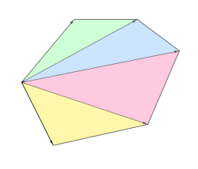
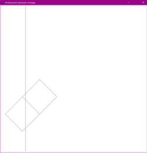
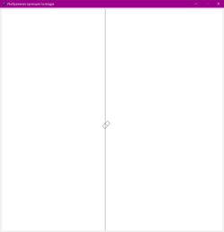

## Постановка задачи
Назовём точку в пространстве «хорошей»,
если её проекция находится строго правее прямой $x=-2$.

_Модифицируйте эталонный проект таким образом,
чтобы определялась и печаталась следующая характеристика
полиэдра: сумма площадей граней,
ровно одна вершина которых — «хорошая» точка._

## Ход решения
### Вычисление площади
В процесе решения задачи потребуется отличать «хорошую» точку от обычной.
Для этого определим для объектов класса ```R3``` атрибут ```is_good```.
Он принимает значение ```True```, если точка «хорошая», а иначе - ```False```.
В том же классе определим два метода:
- ```set_is_good()``` – метод, который определяет, является ли точка «хорошей»
(присваивая соответствующее значение атрибуту ```is_good```).
- ```magnitude()``` – метод, который возвращает модуль вектора с началом в
центре координат и концом в данной точке.  

Для подсчёта площади грани определим метод ```area()``` в классе ```Facet```.
В начале следует создать функцию, которая будет возвращать площадь
треугольной грани, заданной двумя векторами. Такая площадь определяется по
следующей формуле: 
$$S = \frac{1}{2}|\vec{a} \times \vec{b}|$$
где $\vec{a}$, $\vec{b}$ - векторы, исходящие из одной точки
Получая на вход функции грань из произвольного чилса вершин, следует разбить её на несколько треугольников и подсчитать площадь каждого. Суммарная площадь - искомая.

| 
|:--:|
| *Рис.1 Площадь данного многоугольника суммируется из площадей составляющих его треугольников (выделены разными цветами). Каждый из треугольников построен на двух векторах, исходящих из одной точки* |

Реализация метода ```area()```:
~~~{.py include="src/code/area.py"}
~~~

При чтении данных из файла, содержащего информацию о полиэдре, у каждой
точки будем вызвать метод ```is_good()```. Делать это требуется перед
умножением точки на коэффициент гомотетии, т.к. он не влияет на её проекцию. Заметим, что при умножении точки на коэффициент гомотетии, нам возвращается новый объекта класса ```R3```. По этой причине добавим в конструктор данного
класса аргумент, присваивающий значение атрибуту ```is_good```.
Таким образом, даже после домоножении точки на коэффициент гомотетии
мы будем знать, является ли она «хорошей».

В формулировке задачи требуется найти суммы площадей граней, а не их
проекций. Добавим дополнительный список ```_vertexes```, который будет
содержать вершины полиэдра без преобразований. Данный список
будет заполняться вместе со списком преобразованных вершин полиэдра,
поэтому порядок точек в нём будет такой же.

При обработке грани, будем записывать количество «хороших» точек
в переменную ```good_points_num```. Если значение данной переменной
равно $1$, посчитаем площадь грани построенной на заданных вершинах
(используя при этом вершины без преобразований
из списка ```_vertexes```). Найденную площадь прибавим к атрибуту
```good_area``` класса Polyedr.

Модификация части кода, отвечающей за обработку граней:
~~~{.py include="src/code/facet.py"}
~~~

### Модификация класса ```TkDrawer```
Добавим в класса ```TkDrawer``` метод ```draw_line()```, который
рисует линию с учётом коэффициента гомотетии из файла полиэдра и
переменной ```SCALE```

Реализация метода ```draw_line()```:
~~~{.py include="src/code/draw_line.py"}
~~~

### Написание тестов
Для проверки правильности решения задачи были написаны
тесты с использованием простых полиэдров, имеющих простую
структуру (например, две плоскости). Также, специально для тестов были созданы полиэдры: параллелепипед, тетраэдр. Тесты, проверяющие
корректность вычисления площади размещены
в файле ```test_good_vertexes.py```.

На данных изображениях представлен результат работы программы для
параллелепипеда с разным коэффициентом гомотетии.
<p align="center">

| 
|:--:|
| *Рис.2* |

| 
|:--:|
| *Рис.3* |

</p>

Можно заметить, что изменение коэффициента гомотетии
меняет положение красной вертикальной прямой, разделяющей точки на
«хорошие» и обычные. При этом суммарная площадь подходящий граней не меняетсяы